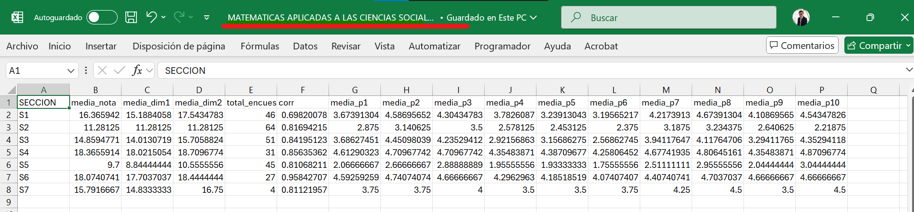

## Utilización de Librerias

Vamos a descargar la libreria tidyverse que contiene un conjunto de librerias útiles para la manipulacion de datos:

```{r librerias, message=FALSE, warning=FALSE}
#install.packages("tidyverse")
library(tidyverse)
```

## Usando la base de datos del drive

No queremos descargar los archivos a nuestra computadora y que llenen poco a poco nuestro memoria (Solo tengo 20 gb disponible );. Por ello, vamos a usar un método para compartir el archivo en formato que se encuentra en la nube de google. Este método debes usarlo por cada encuesta del curso realizada. Si quieres descargar toda la base de datos y tenerla en tu computadora eres libre de hacerlo. Lo único que cambiaría es que debes colocar la dirección donde se encuentra el archivo en tu computadora. 


## Descargando los datos a R

Usando la función `read_csv()` para utilizar el link creado anteriormente para obtener los datos de la encuesta en R

```{r descarga-datos, message=FALSE, warning=FALSE}
encuesta <- read_csv("https://docs.google.com/spreadsheets/d/e/2PACX-1vSoaEsVfQeZ6PCV3WLxWneaO9hNumABkp2VsR_FNwJzGGR2Oker8Me9BtpkfnkcKg/pub?gid=802334479&single=true&output=csv")
```


```{r resultado, include=FALSE}
# Esto no va en la hoja
str(encuesta)
attach(encuesta) #Me ayuda a invocar a las variables de la base de datos sin usar el simbolo "$". Ejem: datos$variable
```

## Transformando los datos

Vamos a transformar los datos de "encuesta" y vamos a recrear una tabla "resultados" donde iremos colocando poco a poco algunos nuevas variables de nuestro interés.

Según lo mencionado por por la coordinación la dimensión 1 consta de la suma de los cinco primeras preguntas de la encuesta. Para que los datos de esta variable se encuentren en la escala del 1-20 (como las notas) lo multiplicamos por el factor de conversión `* 20/30`. Colocamos el resultados en la variable `resultados$dim1`

```{r}
resultados <- encuesta
resultados$dim1 <- P1 + P2 + P3 + P4 + P5 + P6
resultados$dim1_conv <- resultados$dim1 * 20/30
```

La dimensión 2 consta de las últimas cuatro preguntas de la encuesta. No es necesario multiplicar por nada porque la suma de las 4 preguntas se encuentra en la escala del 1 al 20. Colocamos los resultados en `dim2_conv`

```{r}
resultados$dim2_conv <- P7 +P8 + P9 + P10
```

Sacamos el promedio de las dos dimensiones trabajadas anteriormente. Creamos la variable `prom_final` para colocar el resultado.

```{r}
resultados$prom_final <- (resultados$dim1_conv + resultados$dim2_conv )/2 

```
## Tabla resumen 
Ahoora usamos este script para colocar en una tabla los resultados que necesitamos. Basicamente usamos la funcion `sumamarise` para sacar la media, correlación,número de encuestados, etc. La tabla llevará el nombre de `resultados_seccion`
```{r resumen, message=FALSE, warning=FALSE}
resultados_seccion <-  resultados %>% 
  group_by(SECCION) %>% 
  summarise(media_nota = mean(prom_final),
            media_dim1 = mean(dim1_conv),
            media_dim2 = mean(dim2_conv),
            total_encuestados = n(),
            corr = cor(dim1_conv, dim2_conv),
            media_p1 = mean(P1),
            media_p2 = mean(P2),
            media_p3 = mean(P3),
            media_p4 = mean(P4),
            media_p5 = mean(P5),
            media_p6 = mean(P6),
            media_p7 = mean(P7),
            media_p8 = mean(P8),
            media_p9 = mean(P9),
            media_p10 = mean(P10))
```
## Guardamos la tabla creada
Ahora guardamos la tabla en nuestro computadora local en formato `.csv` para luego subirlo al drive.
```{r}
write.table(resultados_seccion, file = "output/resultado.csv", quote = FALSE, row.names = FALSE,sep = ";")
```
## Automatización 
Imaginate tener que copiar cada link de cada encuesta del curso, descargarlo, ponerle un nombre a cada archivo y un largo etc etc.

Vamos a pedirle a R que cree una lista de los cursos con sus respectivos "link" para poder automatizar todo el proceso. Esto permitirá crear las tablas y  los descargue a nuestra computadora (podemos decirle que lo suba a la nube pero eso requiere una serie de permisos).

Nota: Crea una carpeta llamada `output` para colocar todos los archivos`


```{r, warning=FALSE, message=FALSE}
#Creamos nuesta lista de los nombres de los cursos y el link del drive
cursos <- list("REALIDAD NACIONAL Y GLOBALIZACIÓN" = "https://docs.google.com/spreadsheets/d/e/2PACX-1vSoaEsVfQeZ6PCV3WLxWneaO9hNumABkp2VsR_FNwJzGGR2Oker8Me9BtpkfnkcKg/pub?gid=802334479&single=true&output=csv",
               "MATEMATICAS APLICADAS A LAS CIENCIAS SOCIALES" = "https://docs.google.com/spreadsheets/d/e/2PACX-1vRc1766jKI_vuPitKDTpMU0KJWXuQhyZ6GMWPs1vrynhtoRr3-LkvHnAVSPBMXwgg/pub?gid=70215838&single=true&output=csv",
            "LENGUAJE ACADEMICO"= "https://docs.google.com/spreadsheets/d/e/2PACX-1vQfYj1LvFL5ann9zku0NK3FhoNE_CXTLePlZpQ_Ot6c35H971-HDEK16lPHS5wERg/pub?gid=513081199&single=true&output=csv",
            "INTRODUCCION AL DERECHO" = "https://docs.google.com/spreadsheets/d/e/2PACX-1vS_l58M-hbWojA_RBwVy5iVEin6fzekGm1lLZfeSy__DfI6U0xIdbfhsAnC55XqEw/pub?gid=612467673&single=true&output=csv",
            "INTRODUCCIÓN A LA FILOSOFIA" = "https://docs.google.com/spreadsheets/d/e/2PACX-1vQxEcIh9xxKHsz4txT0qSc4D1qWabwCWmDpKOvJkERubYDia7Qxql3xU74Je-1hfg/pub?gid=2129770292&single=true&output=csv",
            "INTRODUCCION A LA CIENCIA POLITICA" = "https://docs.google.com/spreadsheets/d/e/2PACX-1vTPEv3h95UANJadl7zZ8830wg_0hxPGtCVMQnMoknmLa28vluCgn6pPJTvfpBu6Rg/pub?gid=249635838&single=true&output=csv",
            "ARTE Y LITERATURA" = "https://docs.google.com/spreadsheets/d/e/2PACX-1vSOydIBHOLW9eBioNeIAHghcZiBbnrN-WVGtVARsEwva6BnzUInjH164VFIFKQYcw/pub?gid=2981347&single=true&output=csv"
               )

for (nombre_curso in names(cursos)) {
  link <- cursos[[nombre_curso]]
  
  #Creamos un data frame por cada curso
  encuesta <- read_csv(link)
  
  #Creamos nuestra primera variable dim1
  resultados <- encuesta
  
  attach(resultados)
  resultados$dim1 <- P1 + P2 + P3 + P4 + P5 + P6
  resultados$dim1_conv <- resultados$dim1 * 20/30
  
  #Creamos la  variable dim2
  resultados$dim2_conv <- P7 +P8 + P9 + P10
  
  #Creamos la variable prom_final
  resultados$prom_final <- (resultados$dim1_conv + resultados$dim2_conv )/2 
  
  #Creamos nuestra tabla con los datos que necesitamos
  resultados_seccion <-  resultados %>% 
  group_by(SECCION) %>% 
  summarise(media_nota = mean(prom_final),
            media_dim1 = mean(dim1_conv),
            media_dim2 = mean(dim2_conv),
            total_encuestados = n(),
            corr = cor(dim1_conv, dim2_conv),
            media_p1 = mean(P1),
            media_p2 = mean(P2),
            media_p3 = mean(P3),
            media_p4 = mean(P4),
            media_p5 = mean(P5),
            media_p6 = mean(P6),
            media_p7 = mean(P7),
            media_p8 = mean(P8),
            media_p9 = mean(P9),
            media_p10 = mean(P10))
  
  #guaradmos la tabla
  
  #Creamos el nombre que va a tener nuestro archivo
  ubicacion <-  str_c("output/", nombre_curso, ".xlsx")
  #Ahora lo guardamos
  
  writexl::write_xlsx(resultados_seccion,path = ubicacion)
  
  #write.table(resultados_seccion, file = name, quote = FALSE, row.names = FALSE,sep = ";")
  
}
```

## Resultado

Ya tenemos los archivos en nuestra carpeta asignada. Queda revisarlo y subirlo al drive. Eso es todo amig@s.

